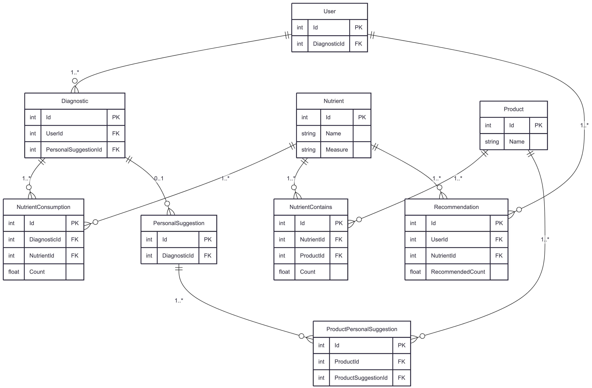

Для запуска использовать Local.
Что бы создать БД можно создать новую бд, и выпонтить на ней New.sql [\Test\DAL.EF\New.sql].
Данные для подключение к бд, в appsettings, ConnectionStrings.

Эндопинт для свагера.
https://localhost:8081/swagger/index.html

.NET 8

